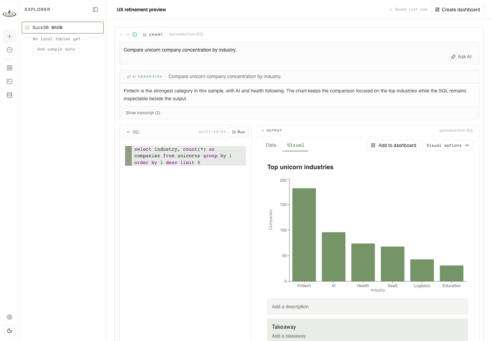

<h1 align="center">Pondview</h1>

<p align="center">DuckDB-powered BI for AI-assisted analysis, SQL, charts, and dashboards.</p>

<p align="center">
  <a href="https://www.npmjs.com/package/@pondview/cli"></a>
  <a href="./LICENSE"></a>
</p>

<p align="center">
  <a href="./packages/pondview-docs/index.md">Documentation</a> ·
  <a href="./packages/cli/README.md">CLI</a> ·
  <a href="./CONTRIBUTING.md">Contributing</a>
</p>

[](./packages/pondview-docs/index.md)

---

### Installation

```bash
# Package managers
npm i -g @pondview/cli@latest
bun add -g @pondview/cli@latest
pnpm add -g @pondview/cli@latest

# Or run without installing
npx @pondview/cli@latest start
bunx @pondview/cli@latest start
```

### Usage

```bash
pondview start
pondview start --database ./analytics.duckdb
pondview start --project-dir ./my-pondview-project
pondview attach ./analytics.duckdb --as analytics
pondview query "SELECT 42 AS answer"
pondview mcp --project-dir ./my-pondview-project
```

### Documentation

For setup, configuration, runtimes, connected sources, dashboards, and AI providers, see the [Pondview docs](./packages/pondview-docs/index.md).

### Development

```bash
bun install
bun dev

bun run pondview start
bun run pondview query "SELECT 42 AS answer"
bun run cli -- mcp
bun run typecheck
bun run lint
bun run test
```

### Packages

- `packages/pondview-app` — React/Vite application
- `packages/cli` — local DuckDB bridge and packaged CLI
- `packages/bridge-protocol` — shared bridge protocol
- `packages/pondview-docs` — documentation site
- `packages/pondview-landing` — marketing site

### License

Apache-2.0. See [LICENSE](./LICENSE).
